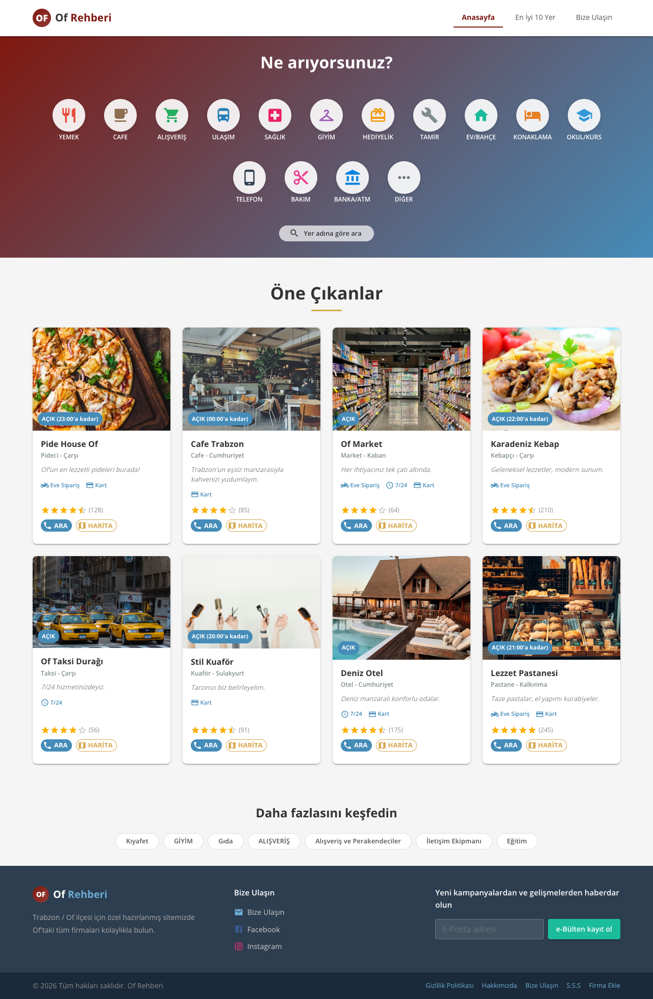
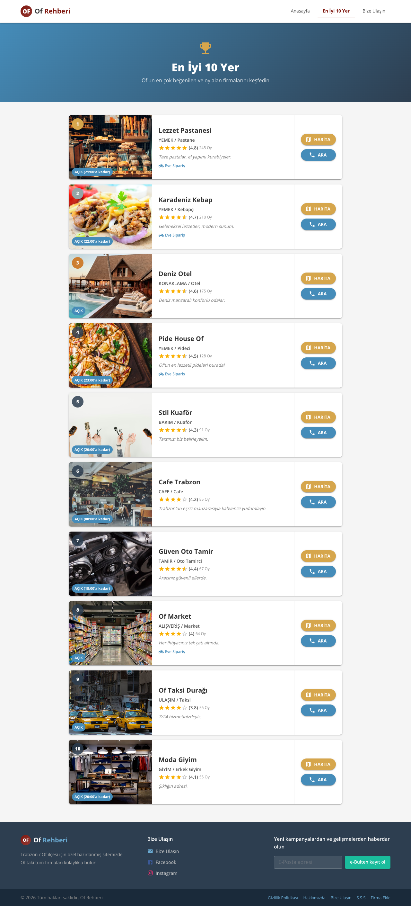
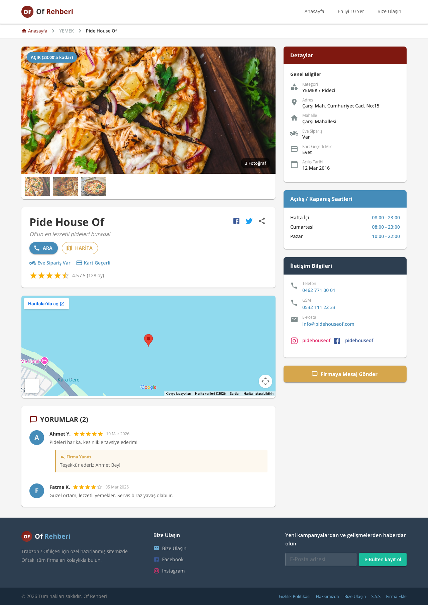
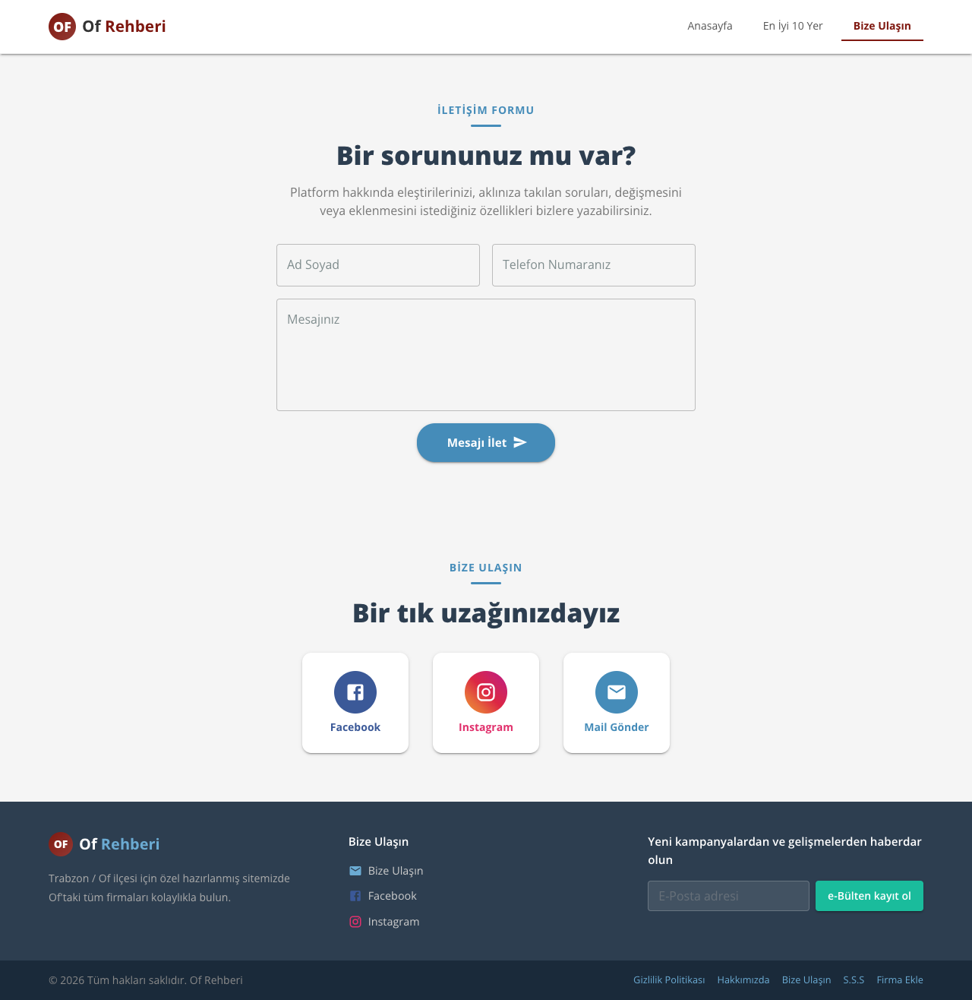

# PROJE RAPORU

## Of Rehberi — React ile Yerel Firma Rehberi Uygulaması

**Proje Adı:** Of Rehberi React  
**Tarih:** 6 Nisan 2026  
**Teknoloji:** React 19 + Material UI 7 + Vite 6  
**Orijinal Kaynak:** [https://www.ofrehberi.com](https://www.ofrehberi.com) (PHP tabanlı)

---

## 1. GİRİŞ

### 1.1 Projenin Amacı

Bu proje, hâlihazırda PHP ile geliştirilmiş ve çalışır durumda olan [ofrehberi.com](https://www.ofrehberi.com) isimli yerel firma rehberi web sitesinin, modern frontend teknolojileri kullanılarak React tabanlı bir Tek Sayfa Uygulaması'na (Single Page Application — SPA) dönüştürülmesini kapsamaktadır.

Amaç; orijinal sitenin tasarımını, renk paletini, sayfa yapısını ve kullanıcı deneyimini koruyarak, React ekosisteminin sunduğu bileşen tabanlı mimari, sanal DOM, istemci tarafı yönlendirme ve Material UI bileşen kütüphanesi gibi modern teknolojilerle yeniden inşa etmektir.

### 1.2 Projenin Kapsamı

Aşağıdaki sayfalar ve özellikler proje kapsamında geliştirilmiştir:

- Anasayfa (firma listeleme, filtreleme, arama, kategorilendirme)
- En İyi 10 Yer sayfası (sıralı firma listesi)
- Firma Detay sayfası (galeri, harita, yorumlar, iletişim bilgileri)
- Bize Ulaşın sayfası (iletişim formu, sosyal medya)
- ARA ve HARİTA modal diyalogları
- Dinamik açık/kapalı durum hesaplama
- Tamamen responsive (mobil uyumlu) tasarım

**Kapsam dışı bırakılanlar:** Kullanıcı giriş/kayıt sistemi, Google AdSense reklamları, trafik/ziyaretçi takibi, gerçek veritabanı bağlantısı.

---

## 2. TEKNOLOJİ SEÇİMLERİ VE GEREKÇELERİ

### 2.1 React (v19.1.0)

React, Facebook tarafından geliştirilen, bileşen tabanlı bir kullanıcı arayüzü kütüphanesidir. Tercih sebepleri:

- **Bileşen Tabanlı Mimari**: Her UI parçası (Header, Footer, BusinessCard, FilterSidebar vb.) bağımsız, yeniden kullanılabilir bileşenler olarak geliştirilmiştir.
- **Sanal DOM**: Sayfa değişikliklerinde yalnızca değişen kısımlar güncellenir, tam sayfa yenilemesi gerekmez.
- **Hooks API**: `useState`, `useCallback`, `useEffect`, `useRef` gibi hook'lar ile fonksiyonel bileşenlerde durum yönetimi sağlanmıştır.
- **Geniş Ekosistem**: Material UI, React Router gibi olgun kütüphaneler ile hızlı geliştirme imkânı sunar.

### 2.2 Material UI — MUI (v7.3.9)

Google'ın Material Design spesifikasyonunu uygulayan React bileşen kütüphanesidir. Tercih sebepleri:

- **Hazır Bileşenler**: AppBar, Card, Dialog, TextField, Rating, Chip, Grid, Drawer gibi 50+ bileşen kullanıma hazırdır.
- **Tema Özelleştirme**: `createTheme()` ile orijinal sitenin renk paleti, tipografi ve bileşen stilleri merkezi olarak tanımlanmıştır.
- **Responsive Yardımcılar**: `useMediaQuery`, Grid `size` prop'u ve `sx` prop'u ile her ekran boyutuna uyumlu tasarım yapılmıştır.
- **İkon Kütüphanesi**: `@mui/icons-material` paketi ile 2.000+ Material Design ikonu kullanılabilir durumdadır.

### 2.3 Vite (v6.3.3)

Yeni nesil frontend derleme aracıdır. Tercih sebepleri:

- **Hızlı Başlatma**: ES modülleri kullanarak geliştirme sunucusu ~70ms'de başlar.
- **Anında Güncelleme (HMR)**: Kod değişikliklerinde sayfa yenilenmeden güncelleme yapılır.
- **Optimized Build**: Rollup tabanlı üretim derlemesi ile minimum dosya boyutu sağlanır.

### 2.4 React Router DOM (v7.14.0)

İstemci tarafı yönlendirme (client-side routing) kütüphanesidir:

- **SPA Navigasyonu**: Sayfa yenilenmeden farklı URL'ler arasında geçiş sağlar.
- **Dinamik Rotalar**: `/company/:slug` parametrik rotası ile firma detay sayfaları desteklenir.
- **`useParams` Hook'u**: URL parametrelerine bileşen içinden erişim sağlar.

---

## 3. MİMARİ YAPI

### 3.1 Bileşen Hiyerarşisi

```
App.jsx
├── ScrollToTop (sayfa geçişinde scroll sıfırlama)
├── Header (navigasyon çubuğu)
├── Routes
│   ├── HomePage
│   │   ├── CategoryGrid (kategori ikonları)
│   │   ├── SubCategorySlider (alt kategori çubugu)
│   │   ├── FilterSidebar (mahalle + özellik filtreleri)
│   │   ├── BusinessCard (firma kartları)
│   │   │   ├── Dialog — ARA (telefon numaraları modal)
│   │   │   └── Dialog — HARİTA (Google Maps modal)
│   │   ├── FeaturedSection (öne çıkanlar)
│   │   └── DiscoverSection (keşfet etiketleri)
│   ├── Top10Page (en iyi 10 yer — yatay kart listesi)
│   ├── BusinessDetailPage (firma detay — galeri, harita, yorumlar)
│   └── ContactPage (iletişim formu + sosyal medya)
└── Footer (alt bilgi alanı)
```

### 3.2 Veri Akışı

```
mockData.js (merkezi veri kaynağı)
    │
    ├── categories ──────→ CategoryGrid, Top10Page, BusinessDetailPage
    ├── subCategories ───→ SubCategorySlider
    ├── neighborhoods ───→ FilterSidebar, HomePage
    ├── businesses ──────→ HomePage, Top10Page, BusinessDetailPage
    ├── businessDetails ─→ BusinessCard, Top10Page, BusinessDetailPage
    └── discoverTags ────→ DiscoverSection
```

Veri akışı **yukarıdan aşağıya** (top-down) props ile sağlanmıştır. Global state yönetimi kütüphanesi (Redux, Zustand vb.) kullanılmamıştır çünkü uygulama karmaşıklığı bunu gerektirmemektedir.

### 3.3 Tema Yapılandırması (`theme.js`)

MUI'nin `createTheme()` fonksiyonu ile merkezi tema tanımlanmıştır:

```javascript
palette: {
  primary:   { main: '#7f1810' },  // Bordo
  secondary: { main: '#458cb9' },  // Koyu Mavi
  warning:   { main: '#d6a64c' },  // Altın
  custom:    { dark: '#2d3e50' },  // Koyu (footer, drawer)
}
typography: {
  fontFamily: '"Open Sans", sans-serif',
}
```

Bu yapılandırma sayesinde tüm bileşenler aynı renk paletini kullanır ve orijinal site ile görsel tutarlılık sağlanır.

---

## 4. SAYFA DETAYLARI

### 4.1 Anasayfa



**Bileşenler:** Hero, CategoryGrid, SubCategorySlider, BusinessCard, FilterSidebar, FeaturedSection, DiscoverSection

**İşlevsellik:**
- 15 kategoriden biri seçildiğinde firmalar o kategoriye göre filtrelenir
- Alt kategori seçimi ile daha spesifik filtreleme
- İsim ile arama (Yer adına göre ara)
- Sol sidebar'dan mahalle ve özellik filtresi
- Firma kartlarında ARA ve HARİTA butonları modal diyalog açar
- Mobilde sidebar, alt kısımdan açılan bir Drawer olarak çalışır

**State Yönetimi (HomePage):**
```
selectedCategory     → Seçili ana kategori
selectedSubCategory  → Seçili alt kategori
searchQuery          → Arama metni
showSearch           → Arama alanı görünürlüğü
filters              → Mahalle + özellik filtreleri
mobileFilterOpen     → Mobil filtre drawer durumu
```

### 4.2 En İyi 10 Yer



**Sıralama Algoritması:**
```javascript
businesses.sort((a, b) => b.totalVotes - a.totalVotes || b.rating - a.rating).slice(0, 10)
```

Önce toplam oy sayısına göre (çoktan aza), eşitlik durumunda ortalama puana göre sıralama yapılır. İlk 10 firma gösterilir.

**Sıra Rozeti Renkleri:**
- 1. sıra → Altın (`#d6a64c`)
- 2. sıra → Gümüş (`#95a5a6`)
- 3. sıra → Bronz (`#cd7f32`)
- 4–10. sıra → Koyu (`rgba(45,62,80,0.85)`)

### 4.3 Firma Detay Sayfası



**URL Yapısı:** `/company/:slug` (ör. `/company/pide-house-of`)

**Bölümler:**
1. **Breadcrumb**: Anasayfa → Kategori → Firma Adı
2. **Fotoğraf Galerisi**: Ana görsel + thumbnail'lar + lightbox
3. **Firma Başlığı**: İsim, slogan, sosyal medya paylaşım ikonları (Facebook, Twitter, Link)
4. **Aksiyon Butonları**: ARA, HARİTA
5. **Özellik Rozetleri**: Eve Sipariş Var, 7/24 Açık, Kart Geçerli
6. **Puan**: Yıldız rating + toplam oy
7. **Google Maps**: İframe embed harita
8. **Yorumlar**: Kullanıcı avatar + isim + puan + yorum + tarih + firma yanıtı
9. **Sağ Sidebar**:
   - Detaylar / Genel Bilgiler
   - Açılış / Kapanış Saatleri (renk kodlu: mavi = açık, kırmızı = kapalı)
   - İletişim Bilgileri (tıklanabilir telefon ve e-posta linkleri)
   - Sosyal medya ikonları (Instagram, Facebook, Twitter)
   - "Firmaya Mesaj Gönder" butonu

### 4.4 Bize Ulaşın



**İletişim Formu Validasyonu:**
- Mesaj alanı boş bırakılamaz
- Mesaj en az 10 karakter olmalıdır
- Gönderim sırasında buton devre dışı kalır + yükleniyor animasyonu
- Başarılı gönderimde yeşil bildirim mesajı

---

## 5. ÖNEMLİ TEKNİK ÇÖZÜMLER

### 5.1 Dinamik Açık/Kapalı Durumu

Orijinal PHP sitesinde açık/kapalı durumu sunucu tarafında hesaplanırken, React versiyonunda bu işlem **istemci tarafında** (kullanıcının cihaz saati ile) yapılmaktadır.

**`src/utils/businessUtils.js`:**

```javascript
export function isBusinessOpen(business) {
  if (business.is724) return true;

  const now = new Date();
  const currentMinutes = now.getHours() * 60 + now.getMinutes();

  const [openH, openM] = business.openTime.split(':').map(Number);
  const [closeH, closeM] = business.closeTime.split(':').map(Number);
  const openMinutes = openH * 60 + openM;
  const closeMinutes = closeH * 60 + closeM;

  if (closeMinutes > openMinutes) {
    return currentMinutes >= openMinutes && currentMinutes < closeMinutes;
  } else if (closeMinutes < openMinutes) {
    // Gece geçişi (ör. 09:00 - 01:00)
    return currentMinutes >= openMinutes || currentMinutes < closeMinutes;
  } else {
    return true; // openTime === closeTime → sürekli açık
  }
}
```

Bu yaklaşım, PHP'deki sunucu tarafı hesaplama mantığının birebir istemci tarafı karşılığıdır.

### 5.2 ARA Modal Sistemi

Orijinal sitedeki `fara()` JavaScript fonksiyonunun React karşılığı olarak MUI `Dialog` bileşeni kullanılmıştır:

- Her telefon numarası (Sabit Hat, Sabit Hat 2, Cep Telefonu) ayrı satırda gösterilir
- Tıklama `<a href="tel:...">` etiketi ile cihazın arama fonksiyonunu tetikler
- Numara tipi ikonu ile ayırt edilir (sabit hat: telefon ikonu, GSM: cep telefonu ikonu)

### 5.3 HARİTA Modal Sistemi

Orijinal sitedeki `googlemapac()` fonksiyonunun karşılığı:

- Firmada `googleMapEmbed` URL'si varsa doğrudan iframe'e yüklenir
- Yoksa firmanın adresi ile Google Maps sorgusu oluşturulur:
  ```
  https://maps.google.com/maps?q={adres},+Of,+Trabzon&output=embed
  ```

### 5.4 ScrollToTop Bileşeni

React Router'da sayfa geçişlerinde tarayıcı scroll pozisyonunu korur. Bu, kullanıcının bir firma detayından geri döndüğünde sayfanın ortasında kalmasına neden olur. `ScrollToTop` bileşeni `useEffect` hook'u ile `pathname` değiştiğinde `window.scrollTo(0, 0)` çağrısı yaparak bu sorunu çözer.

---

## 6. OPTİMİZASYON VE PERFORMANS

### 6.1 Derleme Çıktısı

```
✓ 977 modules transformed
dist/index.html          0.89 kB (gzip: 0.49 kB)
dist/assets/index.css    0.45 kB (gzip: 0.28 kB)
dist/assets/index.js   626.49 kB (gzip: 192.24 kB)
```

Toplam transfer boyutu (gzip): **~193 kB**

### 6.2 Uygulanan Optimizasyonlar

- **CSS-in-JS**: Ayrı CSS dosyaları yerine MUI'nin `sx` prop'u ile bileşen düzeyinde stil
- **Koşullu Render**: Mobil/masaüstü bileşenler `useMediaQuery` ile koşullu render edilir
- **Lazy Loading**: Harita iframe'leri `loading="lazy"` özniteliği ile yüklenir
- **Google Fonts Preconnect**: `index.html`'de `preconnect` ile font yükleme optimize edilmiştir

---

## 7. ORİJİNAL SİTE İLE KARŞILAŞTIRMA

| Kriter | PHP (Orijinal) | React (Bu Proje) |
|--------|----------------|-------------------|
| Mimari | Monolitik (sunucu tarafı) | Bileşen tabanlı (istemci tarafı) |
| Veritabanı | MySQL + PDO | Mock JSON verileri |
| Stil Sistemi | Bootstrap 3 + özel CSS | Material UI 7 |
| JavaScript | jQuery + eklentiler | React 19 + hooks |
| Routing | Apache .htaccess rewrite | React Router v7 |
| Sayfa Yenileme | Her navigasyonda tam yenileme | SPA — yalnızca değişen kısım güncellenir |
| Açık/Kapalı | Sunucu saati (PHP `date()`) | İstemci saati (JS `new Date()`) |
| Modal Sistemler | jQuery ile DOM manipülasyonu | MUI Dialog bileşeni |
| Responsive | Bootstrap grid sistemi | MUI Grid + useMediaQuery hook |
| Build Süreci | Yok (doğrudan PHP) | Vite ile optimize edilmiş derleme |

---

## 8. SONUÇ

Bu projede, mevcut bir PHP tabanlı web sitesi başarıyla React + Material UI kullanılarak modern bir SPA'ya dönüştürülmüştür. Orijinal sitenin tüm görsel tasarımı, renk paleti, kullanıcı deneyimi ve temel işlevselliği korunurken; bileşen tabanlı mimari, istemci tarafı yönlendirme, dinamik durum yönetimi ve responsive tasarım gibi modern web geliştirme pratikleri uygulanmıştır.

Proje, gerçek dünyada çalışan bir uygulamanın modern teknolojilerle yeniden yazılmasına ilişkin kapsamlı bir örnek teşkil etmektedir.

---

**Hazırlayan:** Kubilay Kaan  
**Tarih:** 6 Nisan 2026
