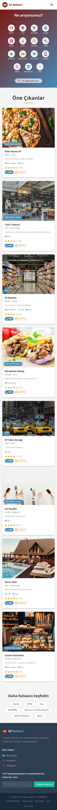
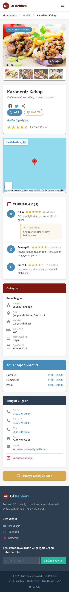

# Of Rehberi - React

Trabzon / Of ilçesi için geliştirilmiş yerel firma rehberi web uygulamasının **React + Material UI** ile modern tek sayfa uygulama (SPA) olarak tasarlanmış halidir. Orijinal PHP tabanlı [ofrehberi.com](https://www.ofrehberi.com) sitesinin birebir React dönüşümüdür.

---

## Ekran Görüntüleri

### Anasayfa (Masaüstü)


### Anasayfa (Mobil)


### En İyi 10 Yer


### Firma Detay Sayfası


### Firma Detay (Mobil)


### Bize Ulaşın


---

## Kullanılan Teknolojiler

| Teknoloji | Versiyon | Açıklama |
|-----------|----------|----------|
| **React** | 19.1.0 | Kullanıcı arayüzü kütüphanesi |
| **Vite** | 6.3.3 | Hızlı geliştirme sunucusu ve derleme aracı |
| **Material UI (MUI)** | 7.3.9 | Google'ın Material Design bileşen kütüphanesi |
| **MUI Icons** | 7.3.9 | Material Design ikon seti |
| **React Router DOM** | 7.14.0 | Sayfa yönlendirme (routing) kütüphanesi |
| **Emotion** | 11.14.x | CSS-in-JS stil motoru (MUI bağımlılığı) |
| **Swiper** | 12.1.3 | Kaydırmalı galeri/slider bileşeni |

### Geliştirme Ortamı

- **Node.js**: v22.20.0
- **npm**: 11.6.1
- **İşletim Sistemi**: macOS

---

## Kurulum ve Çalıştırma

### 1. Gereksinimler

- [Node.js](https://nodejs.org/) (v18 veya üzeri)
- npm (Node.js ile birlikte gelir)

### 2. Projeyi Klonlama

```bash
git clone <repo-url>
cd OfRehberiREACT
```

### 3. Bağımlılıkları Yükleme

```bash
npm install
```

### 4. Geliştirme Sunucusunu Başlatma

```bash
npm run dev
```

Tarayıcıda `http://localhost:5173` adresine giderek uygulamayı görebilirsiniz.

### 5. Üretim Derlemesi (Production Build)

```bash
npm run build
```

Derlenen dosyalar `dist/` klasörüne çıkarılır. Önizleme yapmak için:

```bash
npm run preview
```

---

## Proje Yapısı

```
OfRehberiREACT/
├── index.html                    # Ana HTML dosyası (Google Fonts yükleme)
├── package.json                  # Proje bağımlılıkları ve betikler
├── vite.config.js                # Vite yapılandırması
├── screenshots/                  # Ekran görüntüleri
│   ├── 01-anasayfa.png
│   ├── 02-anasayfa-mobil.png
│   ├── 03-top10.png
│   ├── 04-firma-detay.png
│   ├── 05-firma-detay-mobil.png
│   └── 06-bize-ulasin.png
└── src/
    ├── main.jsx                  # React giriş noktası
    ├── App.jsx                   # Ana uygulama bileşeni (routing)
    ├── theme.js                  # MUI tema yapılandırması (renkler, tipografi)
    ├── index.css                 # Global CSS stilleri
    ├── components/               # Yeniden kullanılabilir bileşenler
    │   ├── Header.jsx            # Üst menü (navbar) + mobil hamburger menü
    │   ├── Footer.jsx            # Alt bilgi alanı + sosyal medya + e-bülten
    │   ├── CategoryGrid.jsx      # Kategori ikonları ızgarası
    │   ├── SubCategorySlider.jsx # Alt kategori yatay kaydırma çubuğu
    │   ├── BusinessCard.jsx      # Firma kartı bileşeni (ARA/HARİTA modalleri)
    │   ├── FilterSidebar.jsx     # Filtreleme yan paneli (mahalle, özellik)
    │   ├── FeaturedSection.jsx   # "Öne Çıkanlar" bölümü
    │   ├── DiscoverSection.jsx   # "Keşfet" etiket bulutu bölümü
    │   └── ScrollToTop.jsx       # Sayfa geçişinde scroll sıfırlama
    ├── pages/                    # Sayfa bileşenleri
    │   ├── HomePage.jsx          # Anasayfa (hero, kategoriler, firma listesi)
    │   ├── Top10Page.jsx         # En İyi 10 Yer sayfası
    │   ├── BusinessDetailPage.jsx # Firma detay sayfası
    │   └── ContactPage.jsx       # Bize Ulaşın / İletişim sayfası
    ├── api/                      # Axios servisleri (backend REST API çağrıları)
    └── utils/
        └── businessUtils.js      # Yardımcı fonksiyonlar (açık/kapalı hesaplama)
```

---

## Sayfalar ve Özellikler

### 1. Anasayfa (`/` veya `/anasayfa`)

- **Hero Bölümü**: Gradient arka planlı arama alanı
- **Kategori Izgarası**: 15 kategori ikonu (Yemek, Cafe, Alışveriş, Ulaşım, Sağlık, Giyim, Hediyelik, Tamir, Ev/Bahçe, Konaklama, Okul/Kurs, Telefon, Bakım, Banka/ATM, Diğer)
- **Alt Kategori Slider**: Seçilen kategorinin alt kategorilerini yatay kaydırmalı gösterir
- **Firma Kartları**: Her firma için resim, durum (AÇIK/KAPALI), isim, alt kategori, mahalle, slogan, özellikler (Eve Sipariş, 7/24, Kart), puan ve oy sayısı
- **ARA Butonu**: Modal açılır → firma telefon numaraları listelenir → tıklanınca arama başlatılır
- **HARİTA Butonu**: Modal açılır → Google Maps iframe ile konum gösterilir
- **Filtreleme Paneli**: Mahalle seçimi, Açık Yerler, Kapalı Yerler, Eve Sipariş, Kart Geçerli filtreleri
- **Öne Çıkanlar**: Koyu arka planlı öne çıkan firma bölümü
- **Keşfet Bölümü**: Etiket bulutu ile kategori keşfi
- **Responsive Tasarım**: Mobilde hamburger menü + filtreleme drawer'ı

### 2. En İyi 10 Yer (`/top10`)

- **Banner**: Mavi gradient, kupa ikonu
- **Yatay Kart Düzeni**: Sıra numarası rozeti (1. altın, 2. gümüş, 3. bronz), firma resmi, bilgiler, HARİTA ve ARA butonları
- **Sıralama**: Toplam oy sayısına göre (azalan), ardından ortalama puana göre
- **ARA/HARİTA Modalleri**: Anasayfadaki ile aynı işlevsellik
- **Responsive Tasarım**: Mobilde alt alta düzen

### 3. Firma Detay Sayfası (`/company/:slug`)

- **Breadcrumb Navigasyonu**: Anasayfa > Kategori > Firma Adı
- **Fotoğraf Galerisi**: Ana görsel + küçük resim önizleme + lightbox (tam ekran görüntüleme)
- **Firma Bilgileri**: İsim, slogan, sosyal medya paylaşım butonları
- **Özellik Rozetleri**: Eve Sipariş, 7/24 Açık, Kart Geçerli
- **Puan ve Oy**: 5 üzerinden yıldız puanlama
- **Google Maps Entegrasyonu**: İframe ile konum haritası
- **Yorumlar Bölümü**: Kullanıcı yorumları + firma yanıtları
- **Sağ Sidebar**:
  - Genel Bilgiler (kategori, adres, mahalle, eve sipariş, kart, açılış tarihi)
  - Açılış/Kapanış Saatleri (hafta içi, cumartesi, pazar — renk kodlu)
  - İletişim Bilgileri (telefon, GSM, e-posta, sosyal medya)
  - "Firmaya Mesaj Gönder" butonu
- **404 Durumu**: Firma bulunamadığında anasayfaya yönlendirme
- **Responsive Tasarım**: Mobilde sidebar alta kayar

### 4. Bize Ulaşın (`/bize-ulasin`)

- **İletişim Formu**: Ad Soyad, Telefon, Mesaj alanları + form validasyonu
- **Sosyal Medya Kartları**: Facebook, Instagram, Mail Gönder
- **Gönderim Simülasyonu**: Başarı mesajı bildirimi

---

## Teknik Detaylar

### Tema ve Renk Paleti

Orijinal ofrehberi.com sitesinin renkleri birebir kullanılmıştır:

| Renk Adı | Hex Kodu | Kullanım Alanı |
|-----------|----------|----------------|
| Bordo | `#7f1810` | Ana renk (primary), logo, butonlar |
| Açık Bordo | `#933933` | KAPALI durumu |
| Mavi | `#6babd3` | Vurgular |
| Koyu Mavi | `#458cb9` | İkincil renk (secondary), AÇIK durumu |
| Altın | `#d6a64c` | Uyarı rengi, HARİTA butonu |
| Koyu | `#2d3e50` | Footer, karanlık bölümler |

### Dinamik Açık/Kapalı Hesaplama

Firmaların açık veya kapalı olması **cihazın anlık saatine** göre hesaplanır. `src/utils/businessUtils.js` dosyasındaki `isBusinessOpen()` fonksiyonu:

- `is724` olan firmalar her zaman açık
- `openTime` ve `closeTime` arasındaki saat kontrolü
- Gece geçişli saatleri destekler (ör. 09:00 - 01:00)
- `openTime === closeTime` durumunu sürekli açık olarak değerlendirir

```javascript
// Örnek kullanım
import { isBusinessOpen } from './utils/businessUtils';

const open = isBusinessOpen(business); // true veya false
```

### Routing (Sayfa Yönlendirme)

React Router DOM v7 ile SPA yönlendirme:

| Yol | Sayfa | Açıklama |
|-----|-------|----------|
| `/` | HomePage | Anasayfa |
| `/anasayfa` | HomePage | Anasayfa (alternatif) |
| `/top10` | Top10Page | En İyi 10 Yer |
| `/bize-ulasin` | ContactPage | İletişim sayfası |
| `/company/:slug` | BusinessDetailPage | Firma detay (ör. `/company/pide-house-of`) |

### Veri Kaynağı

Frontend verileri `src/api` altındaki Axios servisleriyle Spring Boot backend API üzerinden alır.
Firma, kategori, mahalle, yorum, kullanıcı paneli ve admin işlemleri veritabanı bağlantılı REST endpointleriyle çalışır.

### ScrollToTop

Sayfa geçişlerinde scroll pozisyonu sıfırlanır (`ScrollToTop` bileşeni). Bu, kullanıcının bir firma detayından anasayfaya döndüğünde sayfanın en tepeden başlamasını sağlar.

---

## Orijinal Projeyle Karşılaştırma

| Özellik | PHP (Orijinal) | React (Bu Proje) |
|---------|----------------|-------------------|
| Sunucu | Apache + PHP + MySQL | Vite Dev Server (statik) |
| Veri | PDO ile MySQL sorguları | Mock JSON verileri |
| Stil | Bootstrap + özel CSS | Material UI (MUI) |
| JS | jQuery + eklentiler | React + hooks |
| Routing | `.htaccess` ile URL yönlendirme | React Router DOM |
| Açık/Kapalı | Sunucu tarafı saat hesaplama | İstemci tarafı (cihaz saati) |
| Harita | jQuery modal + iframe | MUI Dialog + iframe |
| ARA | jQuery modal | MUI Dialog + `tel:` linkleri |
| Responsive | Bootstrap grid | MUI Grid + useMediaQuery |

---

## Geliştirici Notları

- Proje bir **ödev teslimi** olarak hazırlanmıştır
- Yetkilendirme (giriş/kayıt) sayfaları kapsam dışı bırakılmıştır
- Google AdSense reklamları ve trafik takibi dahil edilmemiştir
- Tüm veriler mock olup gerçek bir API bağlantısı yoktur
- Üretim ortamında kullanılacaksa bir backend API'ye bağlanılması gerekir

---

## Lisans

Bu proje eğitim amaçlı geliştirilmiştir. Tüm haklar saklıdır.

© 2026 Of Rehberi
